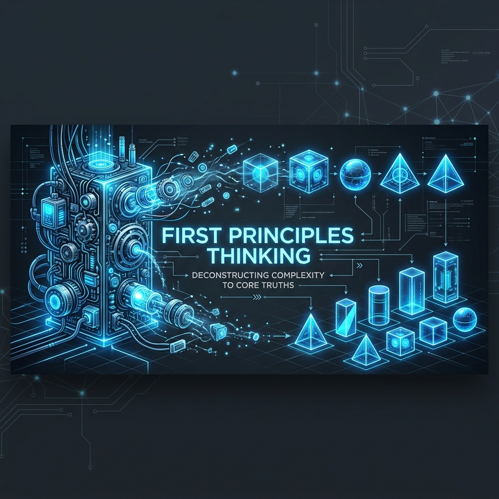
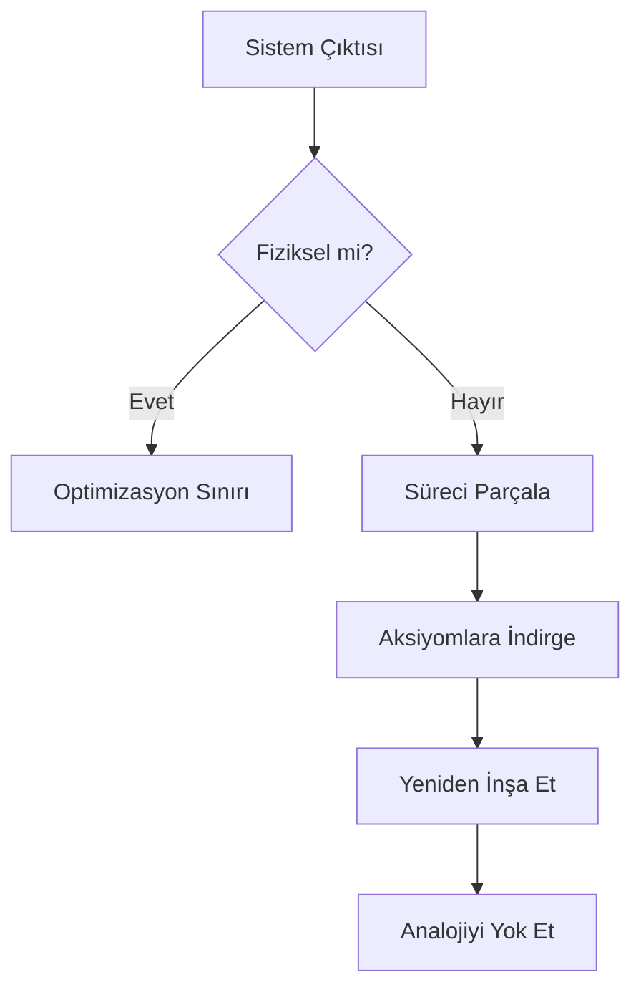

# 🚀 01: İlk Prensiplerle Düşünme (First Principles Thinking)

> **"Fizik kanunları dışında her şey bir önyargıdır."**

Bu dizin, X-Mindset'in atomik birimidir. Biz burada geçmiş başarıları veya endüstri standartlarını taklit etmiyoruz. Biz, gerçekliğin mutlak sınırlarını (fiziksel ve matematiksel aksiyomlar) bulup, sistemi bu çekirdekten yukarıya doğru inşa ediyoruz.

---

## 🔬 Aksiyomatik Yapısöküm Metodu (The Axiomatic Deconstruction)

Mühendislikte en büyük engel teknik yetersizlik değil, **bilişsel atalettir (cognitive inertia)**. Analoji yoluyla düşünmek güvenlidir ama asla devrimci değildir.

### 1. Katmanları Soyma (The Peeling Protocol)
Herhangi bir sistem (yazılım mimarisi, donanım tasarımı veya operasyonel süreç) hakkında sahip olduğunuz tüm inançları listeleyin. Ardından her birine şu soruyu sorun:
- *Bu bir fizik kuralı mı, yoksa bir gelenek mi?*
- *Bu kısıtlamayı kim koydu? Eğer o kişi/departman yoksa, kısıtlama hala geçerli mi?*

### 2. Fiziksel Sınırların Hesabı
Örneğin, bir bataryanın maliyetini düşürmek istiyorsanız, "diğerlerinin ne kadara sattığına" bakmayın.
- **Ham Madde Aksiyomu:** Lityum, nikel, kobalt ve alüminyumun atomik ağırlığı ve spot piyasa fiyatı nedir?
- **Termodinamik Aksiyomu:** Bu maddeleri bir araya getirmek için gereken minimum enerji nedir?
- **Sonuç:** Eğer bu ham madde toplamı $80/kWh ise ve endüstri $200/kWh ödüyorsa, aradaki $120 fiziksel değil, **aptallık vergisidir (stupidity tax)**.

---

## 🛠 Uygulama Çerçevesi: Sokratik Mühendislik

Sadece "nasıl" diye sormayın, "neden" diye beş kez sorun.

| Analoji Yoluyla Düşünme | İlk Prensipler Düşüncesi |
| :--- | :--- |
| "Bu teknoloji hep böyle çalıştı." | "Bu teknolojinin teorik Landauer sınırı nedir?" |
| "Rakiplerimiz bu yöntemi kullanıyor." | "Ham madde ve enerji kısıtları altında başka yol var mı?" |
| "Bu çok pahalı, bütçemizi aşıyor." | "Maliyeti oluşturan hangi ara süreçleri tamamen silebiliriz?" |

---

## 🧩 Pratik Egzersiz: Verimsizlik Avı

Aşağıdaki şemayı kullanarak kendi projenizdeki bir darboğazı (bottleneck) analiz edin:

---

## 🔗 Kaynaklar ve İleri Okuma
- [02_Ana_Algoritma](../02_Ana_Algoritma/README.md) - Yapısökümden sonraki inşa süreci.
- [03_Muhendislik_Fizigi](../03_Muhendislik_Fizigi/README.md) - Fiziksel aksiyomların matematiksel temelleri.

**Durum:** `AKTİF - Yüksek Yoğunluk`
