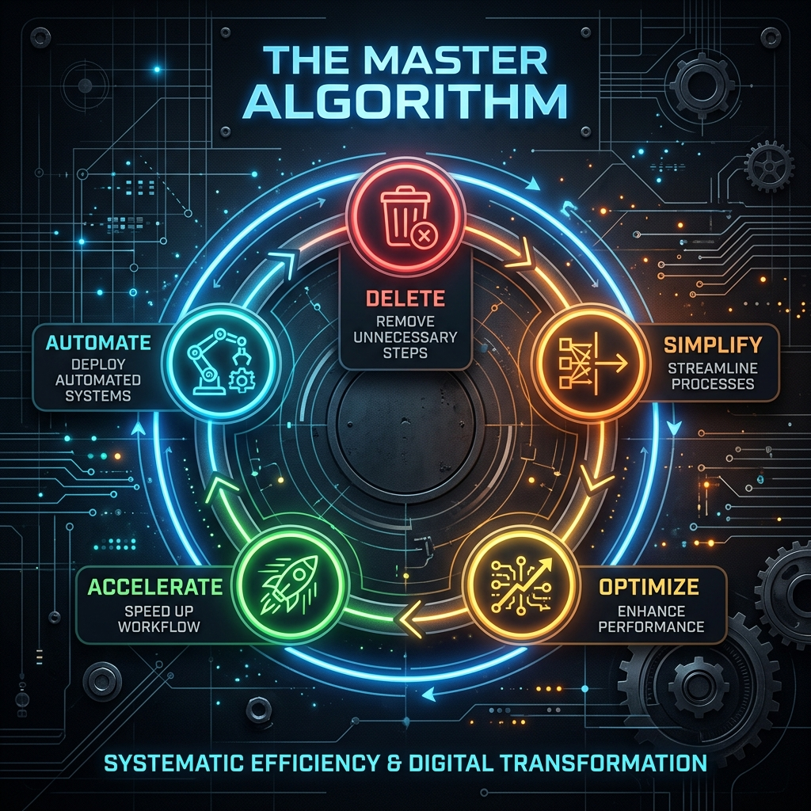

# 🚀 02: Ana Algoritma (The Master Algorithm)

> **"Sildiğinizin en az %10'unu geri eklemiyorsanız, yeterince silmiyorsunuz demektir."**

Bu algoritma, herhangi bir mühendislik problemini veya operasyonel süreci optimize etmek için kullanılan 5 adımlı katı bir protokoldür. **Sıralamayı asla değiştirmeyin.**

---

## 🛠 5 Adımlı Protokol

1. **Gereksinimleri Sorgula:** Her gereksinimin bir ismi olmalı. Departmanlar gereksinim uyduramaz, insanlar uydurur.
2. **Sil:** Parçayı veya süreci silmek için sınırları zorlayın.
3. **Basitleştir/Optimize Et:** Sadece 2. adımdan sağ kalanları optimize edin. En büyük hata, var olmaması gerekeni optimize etmektir.
4. **Hızlandır:** Döngü süresini (cycle time) düşürün.
5. **Otomatize Et:** En son adım. Bir karmaşayı asla otomatize etmeyin.

---

## 📊 Uygulama Metrikleri
- **Silme Verimi:** Kaldırılan parçaların/süreçlerin yüzdesi.
- **Döngü Süresi (Cycle Time):** Fikir ile uygulama arasındaki zaman farkı.
- **Hızlanma Faktörü:** Otomasyon sonrası elde edilen verimlilik artışı.

---

## 📂 İlgili Kaynaklar
- [5 Adım Kontrol Listesi](checklist_5_steps.md)

---
**Durum:** `PROTOKOL AKTİF`
