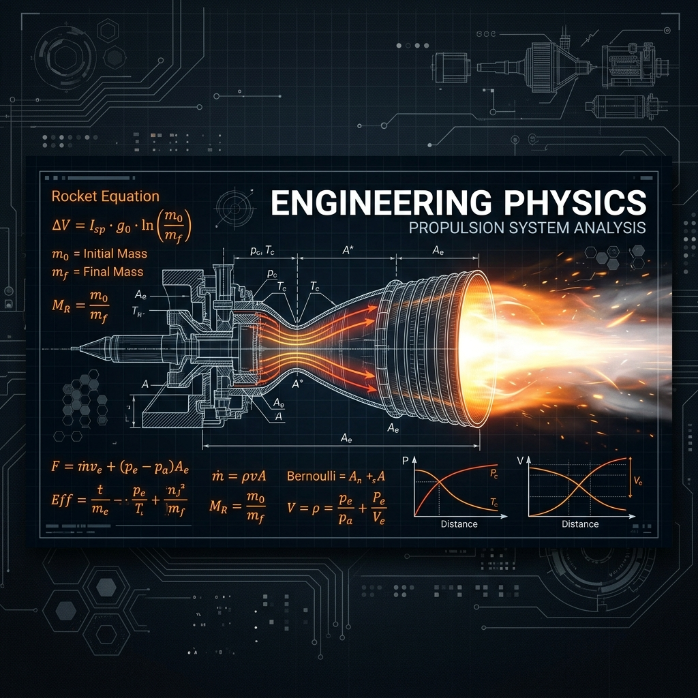

# 🚀 03_Muhendislik_Fizigi (Engineering Physics)

> **"Kısıtlamaları fiziksel limitlere kadar itin. Geriye kalan her şey pazarlık edilebilir."**

# ⚙️ 03: Mühendislik Fizigi (Engineering Physics)

Bu track, sistemlerin teorik sınırlarını belirlemek için kullanılan matematiksel ve fiziksel modelleri içerir. Eğer bir sistemin fiziksel limitlerini bilmiyorsanız, onu optimize edemezsiniz.

---

## 🚀 Tsiolkovsky Roket Denklemi (Sistem Analojisi)

Mühendislikte her bağımlılık bir "kütle"dir. Projenizin hızı ($\Delta v$), çekirdek değerinizin ($m_f$) toplam yüke ($m_0$) oranına bağlıdır.

$$\Delta v = v_e \ln \left( \frac{m_0}{m_f} \right)$$

- **Yazılım Mimarisi:** Algoritmik karmaşıklık ve donanım kullanımı.
- **Sistem Entegrasyonu:** Enerji yönetimi ve termal kısıtlamalar.

---
**Durum:** `Fiziksel Yasalar Tanımlandı`
