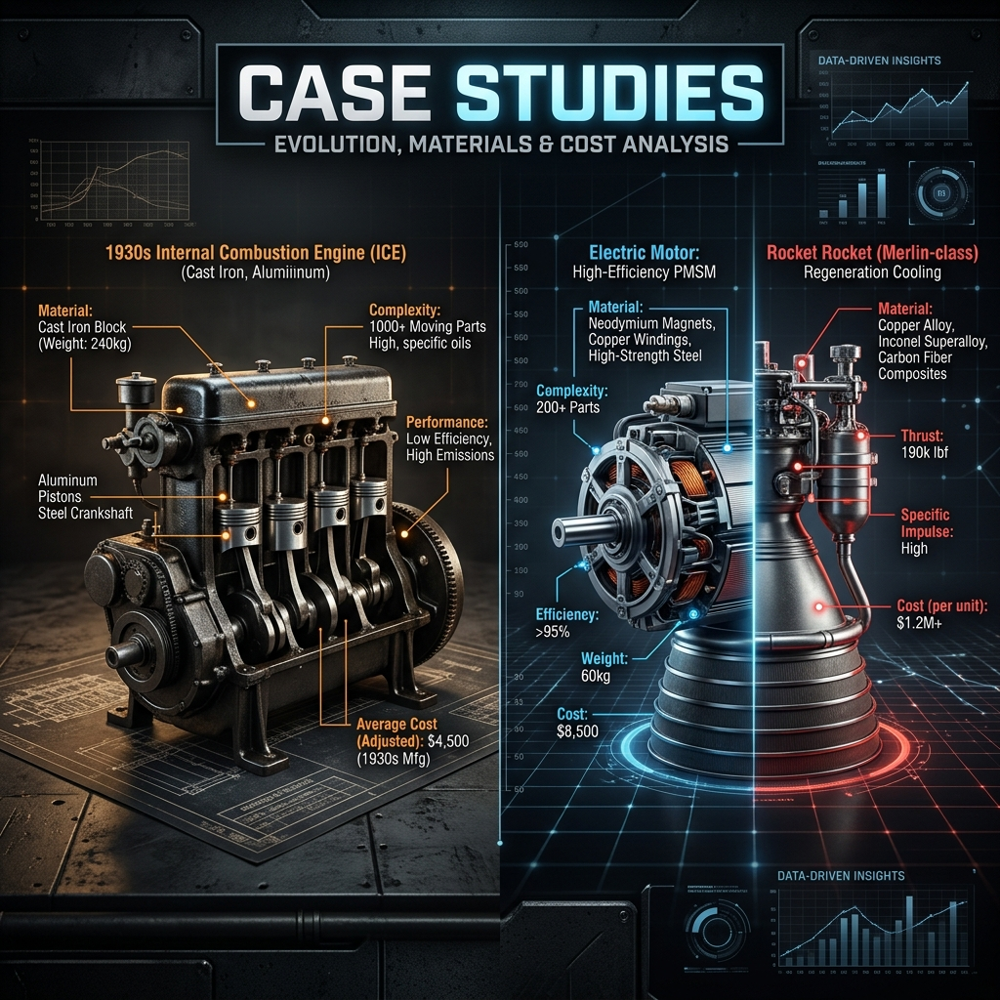

# 🔍 04: Vaka Analizleri (Case Studies)

> **"Teori sizi bir yere kadar götürür; fiziksel gerçeklik ise nihai yargıçtır."**

Bu track, İlk Prensipler ve Ana Algoritma metotlarının gerçek dünya projelerindeki başarısızlıkları ve başarıları nasıl açıkladığını analiz eder.

---

## 🛠 Analiz Arşivleri

### [SaaS ROI Analizi](saas_roi_analysis.md)
*   **Odak:** Yazılım kütlesinin ($m_0$) ve şişirilmiş maliyetlerin İlk Prensipler ile yapısökümü.
*   **Ders:** Kendi araçlarınızı inşa ederek "Vertical Integration" sağlamak.

### [Model 3 Üretim Darboğazı](model3_production_bottleneck.md)
*   **Odak:** "Üretim Cehennemi" ve otomasyonun yanlış sırada uygulanmasının maliyeti.
*   **Ders:** 5 Adımlı Algoritma'yı asla atlamayın.

### [Yazılım Bağımlılıkları Analizi] (Hazırlanıyor)
*   **Odak:** Modern bir web app'in bağımlılık grafiği ve teknik borç kütlesi.

---

## 📊 Önce/Sonra Matrisi
| Vaka | Problemli Yaklaşım | X-Mindset Çözümü | Sonuç |
| :--- | :--- | :--- | :--- |
| SaaS | Abonelik Odaklı | Dahili Araç İnşası | %90 Maliyet Tasarrufu |
| Model 3 | Aşırı Otomasyon | Manuel Basitleştirme | Üstel Üretim Artışı |

---
**Durum:** `VAKALAR DOKÜMANTE EDİLDİ`
