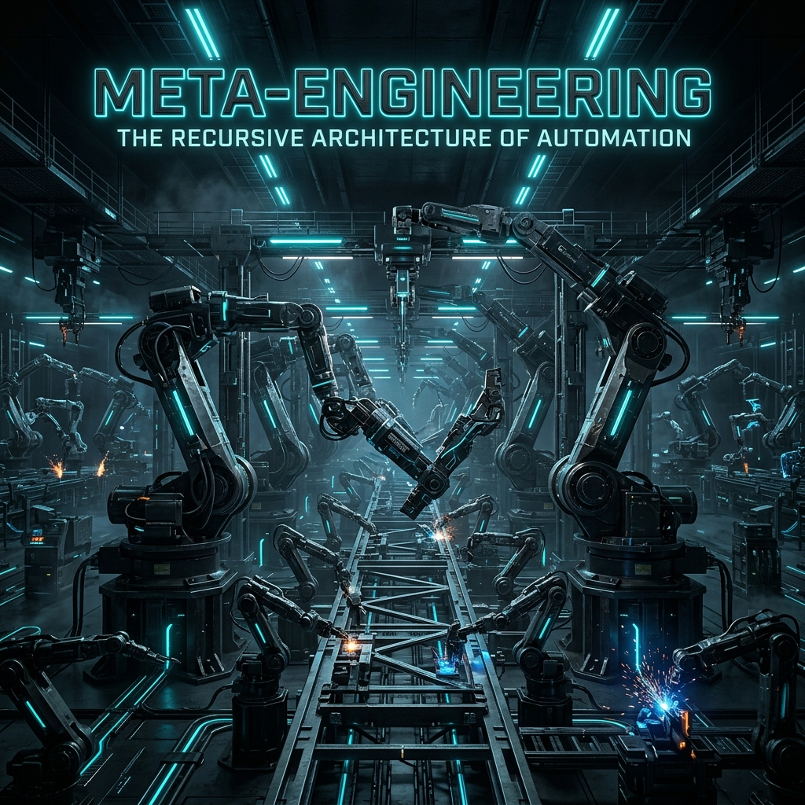

# 🏗 05: Meta-Mühendislik (The Machine that builds the Machine)

> **"Ürün bir vektördür; o ürünü üreten makine (fabrika) ise büyüklüktür."**

X-Mindset'te biz sadece "şeyler" tasarlamıyoruz; biz bu şeyleri otonom, ölçeklenebilir ve hatasız üreten **üst-sistemleri (meta-systems)** tasarlıyoruz.

---

## 🌀 Rekürsif Geliştirme İlkesi

Bir mühendisin görevi, ürünü manuel olarak mükemmelleştirmek değil, tasarımı ve üretimi mükemmelleştiren süreçleri otomatize etmektir.
- **Odak Noktası:** Ürün tasarımındaki bir iyileştirme lineer kazanç sağlar; fabrika tasarımındaki bir iyileştirme üstel (exponential) kazanç sağlar.

### Sistem Otonomisi Seviyeleri (SOSE)
1. **Seviye 1:** Manuel üretim, manuel test.
2. **Seviye 2:** Otomatik testler ve CI/CD (Yazılım).
3. **Seviye 3:** Otomatik üretim hatları ve temel robotik entegrasyonu.
4. **Seviye 4:** Veri odaklı geri bildirim döngüleri; sistem kendi hatalarını raporlar.
5. **Seviye 5:** **Lights-Out Production;** sistem kendi kendini onarır, optimize eder ve bir sonraki iterasyonu başlatır.

---

## ⚡ Donanım İçin CI/CD (Hardware-as-Code)

Meta-mühendislik, yazılım dünyasındaki iterasyın hızını fiziksel dünyaya taşımayı hedefler.
- **Digital Twin:** Fiziksel hat kurulmadan önce sistemin matematiksel olarak simüle edilmesi.
- **Rapid Prototyping:** İlk prensiplerden (Track 01) gelen doğrulamayı fiziksel prototipe saniyeler içinde dökebilmek.

---

## 🛠 Protokoller
- **Tooling First:** Bir parça yapmadan önce, o parçayı yapacak aparatı (jig) veya yazılımı tasarla.
- **Bottleneck Hunting:** Meta-makinedeki en yavaş adımı bul ve tüm R&D gücünü oraya odakla.

---
**Durum:** `SİSTEM MİMARİSİ OLUŞTURULDU`

- [x] Track 01 Expansion: First Principles Thinking <!-- id: 0 -->
- [x] Track 02 Expansion: The Master Algorithm <!-- id: 1 -->
- [x] Track 03 Expansion: Engineering Physics <!-- id: 2 -->
- [x] Track 04 Expansion: Case Studies <!-- id: 3 -->
- [x] Track 05 Expansion: Meta-Engineering <!-- id: 4 -->
- [/] Track 06 Expansion: Hard Engineering <!-- id: 5 -->
- [ ] Track 07 Expansion: Strategic Venture Design <!-- id: 6 -->
- [ ] Track 08 Expansion: Monk Mode <!-- id: 7 -->
- [ ] Track 09 Expansion: Execution & Ethics <!-- id: 8 -->
- [ ] Track 10 Expansion: Curriculum <!-- id: 9 -->
- [ ] Visual Standardization (Banners/Headers) <!-- id: 10 -->
- [ ] Final Review & Cross-Linking <!-- id: 11 -->
**Durum:** `Meta-Sistem Çerçevesi Operasyonel`
