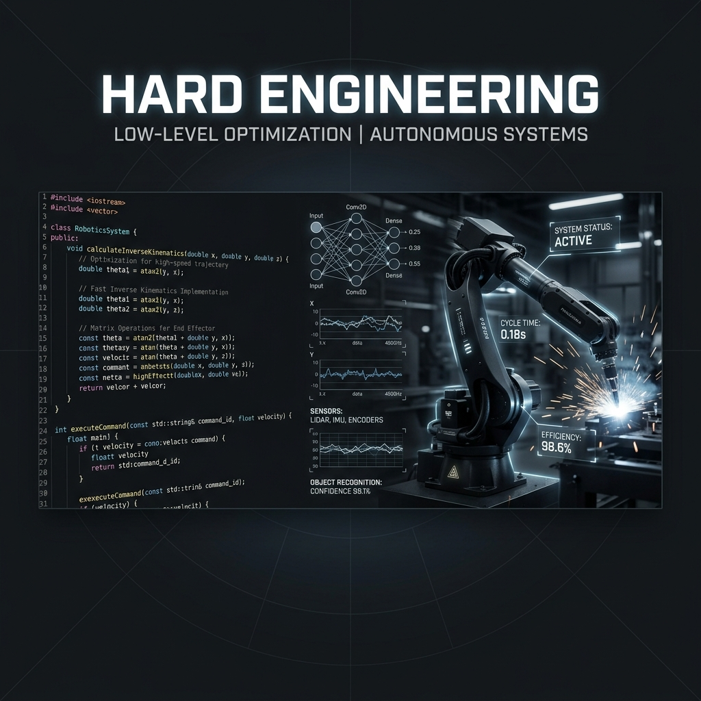

# 🚀 06: Sert Mühendislik (Hard Engineering)

> **"Fizik kanundur, geri kalan her şey bir öneridir."**

Bu track, teorik zihinsel modellerin (Track 01-03) gerçek dünya sistemlerine (kod, metal ve silikon) uygulanmasını kapsar. X-Mindset'te sert mühendislik, performansın ve verimliliğin teorik sınırlara kadar zorlanmasıdır.

---

## ⚡ Sistem Mimarisi Prensipleri

### 1. Düşük Entropili Yazılım (C++/Rust)
Yazılım bir kütledir. Her ek kütüphane, her soyutlama katmanı sistemin "başlangıç kütlesini" ($m_0$) artırır.
- **Sıfır Maliyetli Soyutlamalar (Zero-cost Abstractions):** Sadece gerçekten ihtiyacınız olan donanım kaynaklarını tüketen diller kullanın.
- **Bellek Verimliliği:** Cache-friendly veri yapıları ve manuel bellek yönetimi (gerektiğinde) ile Landauer sınırına yaklaşın.

### 2. Edge AI ve Donanım Hızlandırma
AI modellerini bulutta değil, fiziksel dünyanın sınırında (Edge) çalıştırın.
- **Kuantizasyon:** FP32'den INT8'e geçerek enerji yoğunluğunu artırın.
- **Latency Over All:** Karar verme mekanizması ile fiziksel aksiyon arasındaki süreyi milisaniyelerin altına indirin.

### 3. Otonom Kontrol (ROS2/Control Theory)
Sistemlerin kendi kendilerini yönetmesini sağlayın.
- **LQR/MPC Kontrolcüler:** Karmaşık fiziksel sistemleri matematiksel olarak modelleyin ve optimize edin.
- **Fail-Safe Sistemler:** Donanım seviyesinde yedeklilik ve watchdog sistemleri.

---

## 📂 Teknik Dokümantasyon
- **[C++ Standartları](cpp_standards.md):** Yüksek performanslı sistemler için katı yazım kuralları.
- **[Edge AI Optimizasyonu](edge_ai_optimization.md):** Model sıkıştırma ve dağıtım teknikleri.
- **[ROS2 Otonom Kontrol](ros2_autonomous_control.md):** Robotik sistem mimarisi.

---

## 📊 Ölçülebilir Başarı (Hard Metrics)
| Metrik | Hedef | Birim |
| :--- | :--- | :--- |
| **Gecikme (Latency)** | < 10 | ms |
| **Enerji Verimliliği** | > 85 | % |
| **Uptime (Kritik Sistemler)** | 99.999 | % |

---
**Durum:** `MÜHENDİSLİK YOLLARI OLUŞTURULDU`
