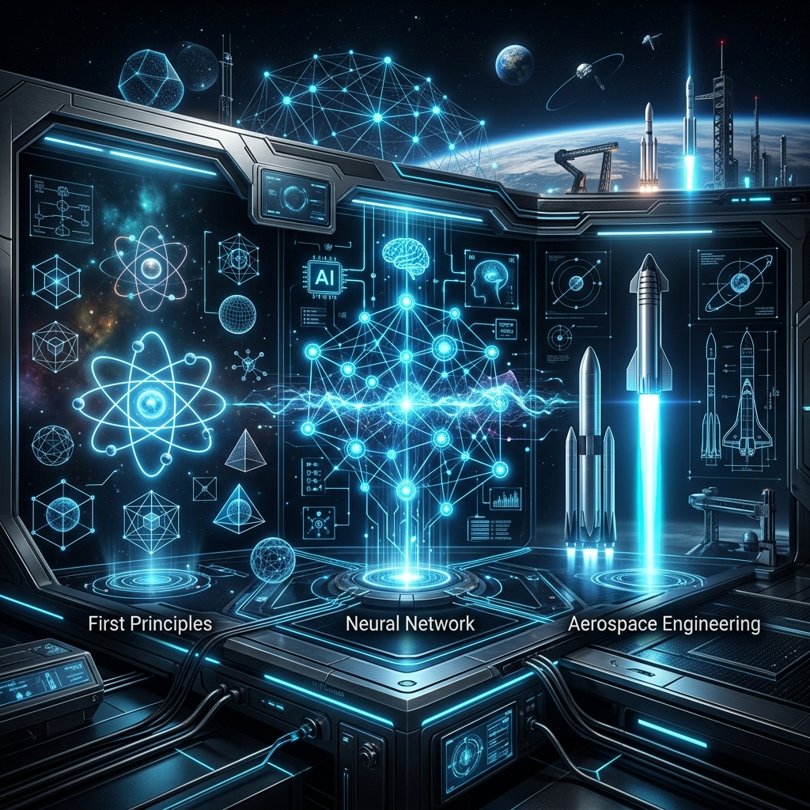

# 🚀 X-Mindset: İlk Prensipler (First Principles) Çerçevesi

> **"Fizik kanundur, geri kalan her şey bir öneridir." - Elon Musk**

---

**X-Mindset Çerçevesine** hoş geldiniz. Bu depo bir biyografi, bir anma yazısı veya motivasyon günlüğü değildir. Bu, Elon Musk'ın mühendislik, üretim ve yönetim felsefelerinden titizlikle tersine mühendislik (reverse-engineering) yapılarak türetilmiş, yapılandırılmış ve katı bir **Zihinsel İşletim Sistemi**'dir.

Mühendisler, kurucular ve üreticiler için tasarlanan bu çerçeve; imkansız görünen sorunları çözmek, ölçeklenebilir sistemler kurmak ve ekstrem hızlarda yürütme (execution) yapmak için gereken tam zihinsel modelleri sağlar. Eğer analoji yoluyla (analogical reasoning) düşünüyorsanız, yanlış yerdesiniz.

---

## 🧠 Temel Protokol: İlk Prensiplerle Düşünme (First Principles Thinking)

Bu işletim sisteminin temeli, mevcut durumun (status quo) reddedilmesidir. Normal mühendislik, *"Bu daha önce nasıl yapıldı?"* diye sorar. İlk Prensipler mühendisliği ise şunu sorar: *"Fizik kanunları tarafından dikte edilen mutlak sınırlar nelerdir?"*

### Yapısöküm Metodu (The Deconstruction Method)
1. **Dogmayı Belirle:** Bir sorun hakkındaki yerleşik inanç nedir? (Örn: "Roketler tek kullanımlık olmak üzere tasarlanmıştır.")
2. **Aksiyomlara İndirge:** Sorunu mutlak, reddedilemez fiziksel gerçeklere ayırın. (Örn: "Bir roket sadece havacılık seviyesinde alüminyum, titanyum, bakır ve karbon fiber koleksiyonudur. Emtia piyasasında bu elementlerin ham madde maliyeti nedir?")
3. **Sıfırdan Yeniden İnşa Et:** Çözümü o ham maddelerden yukarıya doğru inşa edin. Eğer hesapladığınız maliyet, endüstri standardından kat kat düşükse, aradaki fark sadece kötü mühendislik ve miras kalan (legacy) genel giderlerin bir sonucudur. Bu genel giderleri ortadan kaldıran makineyi siz inşa elmelisiniz.

---

## 🛠 Ana Algoritma (The Master Algorithm)

Bu 5 adımlı algoritma; yazılım mimarisi, donanım tasarımı ve organizasyonel yapılar için geçerli olan, üretimin değişmez kanunudur. **Sıralama mutlaktır. Adımların sırasını asla değiştirmeyin.**

### 1. Gereksinimlerinizi daha az aptalca yapın
Sisteminizdeki her gereksinim, bir departmana değil, belirli bir insana bağlı olmalıdır. Departmanlar sorgulanamaz; insanlar sorgulanabilir. Gereksinimi yazan kişiyi bulamıyorsanız veya gerekçeleri ilk prensipleri ihlal ediyorsa, o gereksinimi derhal silin.

### 2. Parçayı veya süreci silmek için çok zorlayın
Sisteme ara sıra bir parça eklemek zorunda kalmıyorsanız, yeterince silmiyorsunuz demektir. "Her ihtimale karşı lazım olur" ifadesi mühendislikteki en yıkıcı cümledir. Her kod satırı, her mekanik parça ve her yönetsel süreç bir yüktür (liability). Onları silin.

### 3. Basitleştirin veya optimize edin
Mühendislikteki en yaygın ve felaket getiren hata, aslında var olmaması gereken bir bileşeni veya süreci optimize etmektir. Sadece 2. Adımdaki titiz silme protokolünden sağ kalanları optimize edin.

### 4. Döngü süresini (cycle time) hızlandırın
Sistem fazlalıklardan arındırıldığında ve optimize edildiğinde, yürütme hızını artırın. Daha hızlı hareket edin. Şiddetle yineleyin (iterate). Ancak unutmayın: bozuk bir sistemi hızlandırmak sadece felaketleri daha hızlı yaratır.

### 5. Otomatize edin
Son adım. Bir karmaşayı asla otomatize etmeyin. Süreç matematiksel olarak kanıtlanmadan ve algoritmanın ilk dört adımıyla rafine edilmeden robotları getirmeyin veya dağıtım (deployment) scriptlerini yazmayın.

---

## ⚙️ Mühendislik Fiziği (Zihinsel Modeller)

İster Rust ile bir backend servisi yazın, ister mekanik bir aktüatör tasarlayın; kaynaklarınıza fiziksel bir kütle gibi davranın. **Tsiolkovsky Roket Denklemi**, sistem bağımlılıkları için nihai zihinsel modeldir:

$$\Delta v = v_e \ln \left( \frac{m_0}{m_f} \right)$$

* **$\Delta v$ (Delta-v):** Projenizin maksimum yeteneği, ölçeklenebilirliği veya hızı.
* **$m_0$ (Başlangıç Kütlesi):** Tüm şişirilmiş bağımlılıklar, legacy kodlar ve gereksiz özellikler dahil sisteminizin toplam ağırlığı.
* **$m_f$ (Final Kütlesi):** Çekirdek, optimize edilmiş mantığınızın ağırlığı.

**Ders:** Eklediğiniz her gereksiz bağımlılık ($m_0$), sisteminizin hedefine ($\Delta v$) ulaşma yeteneğini üstel olarak düşürür. Kütleyi düşük tutun. Kod tabanını hafif tutun.

### Gelişmiş Aksiyomatizasyon: Enerji Yoğunluğu Mantığı
Güç tabanlı herhangi bir sistemi (EV, AI Veri Merkezleri, Robotik) değerlendirirken, mevcut batarya/GPU fiyatlarını görmezden gelin. Bunun yerine şunlara odaklanın:
- **Özgül Enerji ($Wh/kg$):** Kimyanın teorik sınırı nedir?
- **Hesaplama Yoğunluğu ($FLOPS/W$):** Landauer Sınırı'na ne kadar yakınız?

---

## 🎯 Vaka Analizi: Batarya Maliyetinin İlk Prensipleri

Bu çerçevenin gücünü anlamak için batarya maliyetlerinin "imkansız" görülen sorununu ele alalım:

1. **Analoji:** "Bataryalar $600/kWh maliyetindedir. Tarihsel eğilimler nedeniyle her zaman pahalı kalacaklardır."
2. **İlk Prensipler Yapısökümü:**
   - Ham maddeler nelerdir? Kobalt, Nikel, Alüminyum, Lityum, Karbon, Polimerler ve bir teneke kutu.
   - Bu elementlerin spot piyasa fiyatları nedir?
   - **Aksiyom:** Eğer bu malzemeleri Londra Metal Borsası'ndan satın alıp birleştirseydiniz ("sihirli değnek" metodu), maliyet kabaca $80/kWh olurdu.
3. **Sonuç:** $520'lık fark fizik kuralı değildir; verimsiz işleme, lojistik ve geleneksel üretim dogmalarının bir sonucudur.
4. **Eylem:** Batarya tedarikçileriyle pazarlık yapmayı bırakın. Ham cevheri bitmiş hücrelere dönüştüren fabrikayı tek bir sürekli hatta inşa edin.

---

## 🏗️ Meta-Mühendislik: Makinayı İnşa Eden Makina

Ürün bir vektördür; fabrika ise büyüklüktür (magnitude). X-Mindset'te sadece parçaları tasarlamıyoruz; o parçaları üreten otonom sistemleri tasarlıyoruz.

* **Rekürsif İyileştirme İlkesi:** İnşa ettiğiniz her araç, daha iyi bir araç inşa etmek için kullanılmalıdır.
* **Seviye 1 Otonomi:** Otomatik testler ve CI/CD.
* **Seviye 5 Otonomi:** Sistem kendi darboğazlarını (bottlenecks) belirler, bir tasarım değişikliği önerir ve kendi kendini düzeltmeyi yürütür.
* **Sermaye Hızı (Capital Velocity):** Üstel bir büyüme eğrisini korumak için her bir birim çıktıyı tekrar "Meta-Makine"ye yatırın.

---

## 🧘‍♂️ Operasyonel Protokol: [MONK MODE]

**Durum:** `AKTİF` | **Hedef:** `Eylül 2026`

Bu çerçeveyi yürütmek için yüksek yoğunluklu bir bilişsel ortama geçilmelidir. Yüksek yoğunluklu mühendislik, düşük entropili çevre gerektirir.

| Aşama | Protokol | Mantık |
| :--- | :--- | :--- |
| **Derin Çalışma (Deep Work)** | Haftalık 80+ Saat | Girdi (input), çıktı vektörünüzün büyüklüğünü belirler. |
| **Bilgi Diyeti** | Sıfır Sosyal Medya | Sinyal-gürültü oranını maksimize etmek için dış gürültüyü minimize edin. |
| **İzolasyon** | Kesin "Toplantı Yok" Alanları | Asenkron iletişim, verimliliğin varsayılan durumudur. |
| **Fiziksel Ayarlama** | %100 Çıktı Odağı | Biyolojik gövdeyi, zihinsel OS için temel donanım olarak ele alır. |

---

## ⚔️ Yürütme Taktikleri ve Sert Etik

* **Sinyal-Gürültü Oranı:** Yüksek yoğunlukla iletişim kurun. Sıfatları, dolgu sözcüklerini ve kurumsal jargonu kaldırın. Kesinlikle verilere, metriklere ve fiziksel gerçekliklere odaklanın.
* **Kritik Yolu Kucaklayın:** Proje takviminizdeki "Tek Başarısızlık Noktasını" (SPOF) sürekli olarak tanımlayın. Darboğaz kırılana kadar kritik yola agresif bir şekilde saldırın.
* **Veri Olarak Başarısızlık:** Bir şeyler başarısız olmuyorsa yeterince hızlı inovasyon yapmıyorsunuz demektir. Her başarısızlığı, bir sonraki yinelemenize rehberlik eden yüksek sadakatli (high-fidelity) bir veri noktası olarak görün.
* **Adversarial Collaboration (Çekişmeli İş Birliği):** Her fikre meydan okuyun. Eğer bir tasarım "İlk Prensipler" saldırısına dayanamıyorsa, zayıftır ve değiştirilmelidir.

---

## 📚 Müfredat (Zorunlu Okuma Listesi)

Bu zihniyeti tam olarak yüklemek için onu şekillendiren temel metinleri özümsemelisiniz:

* **Mühendislik ve Fizik:** *Structures: Or Why Things Don't Fall Down* - J.E. Gordon
* **Sistemik Düşünme:** *Superintelligence* - Nick Bostrom
* **Perspektif ve Ölçek:** *The Hitchhiker's Guide to the Galaxy* - Douglas Adams
* **Biyografi ve Bağlam:** *Elon Musk* - Walter Isaacson
* **Girişim Yaratma:** *Zero to One* - Peter Thiel

---

## 🏁 Repo Mimarisi ve Kullanım

Bu çerçeve, otonom yürütme için uzmanlaşmış yollara ayrılmıştır:

- [🚀 01_Temel_Ilkeler](01_Temel_Ilkeler/README.md) - Teorik çekirdek ve Aksiyomatizasyon metotları.
- [🚀 02_Algoritma](02_Algoritma/README.md) - 5 adımlı mühendislik protokolünün derinlemesine analizi.
- [🚀 03_Sert_Muhendislik](03_Sert_Muhendislik/README.md) - Sistem mimarisi, C++ ve AI.
- [🚀 04_Stratejik_Girisim_Tasarimi](04_Stratejik_Girisim_Tasarimi/README.md) - Risk yönetimi ve R&D tahsis mantığı.
- [🚀 05_Meta_Muhendislik](05_Meta_Muhendislik/README.md) - "Makinayı inşa eden makina" üzerine dokümantasyon.

---

## 🏛️ Yönetişim

Bu proje, **Meta-Engineering Research Lab** ekosisteminin bir girişimidir. Tüm katkılar `CONTRIBUTING.md` içinde belirtilen yüksek yoğunluklu teknik gereksinimleri karşılamalıdır.

**Kurucu:** [arch-yunus](https://github.com/arch-yunus)  
**İttifak:** *Anka Silicon Dynamics*

*Build the machine that builds the machine.*